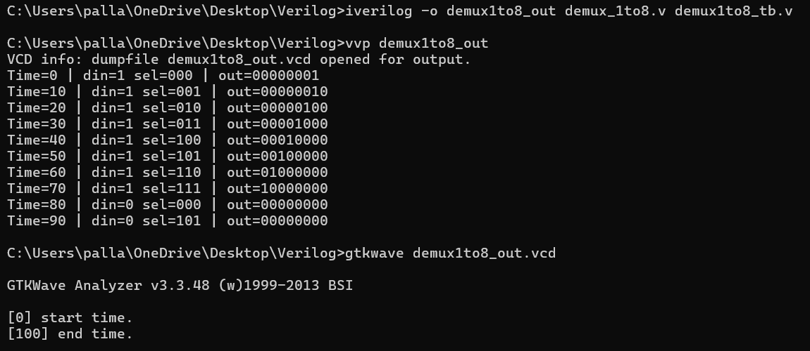

# Demultiplexers (1:4 and 1:8) 

This folder contains Verilog implementations of **1:4** and **1:8 Demultiplexers** using behavioral and hierarchical modeling.

##  1:4 Demultiplexer

- **Inputs**: `din`, `sel[1:0]`
- **Outputs**: `out[3:0]`
- **Logic**: Routes `din` to one of the 4 outputs based on the 2-bit selector.

###  Truth Table (1:4 Demux)

| `din` | `sel[1:0]` | `out[3:0]` |
|:-----:|:----------:|:----------:|
|   1   |    00      |   0001     |
|   1   |    01      |   0010     |
|   1   |    10      |   0100     |
|   1   |    11      |   1000     |
|   0   |   Any      |   0000     |

##  1:8 Demultiplexer

- **Inputs**: `din`, `sel[2:0]`
- **Outputs**: `out[7:0]`
- **Structure**: Built using two instances of 1:4 demux.
  - First stage: splits `din` using `sel[2]`
  - Second stage: selects one of 4 outputs using `sel[1:0]`

###  Truth Table (1:8 Demux)

| `din` | `sel[2:0]` | `out[7:0]`     |
|:-----:|:----------:|:--------------:|
|   1   |   000      | 00000001       |
|   1   |   001      | 00000010       |
|   1   |   010      | 00000100       |
|   1   |   011      | 00001000       |
|   1   |   100      | 00010000       |
|   1   |   101      | 00100000       |
|   1   |   110      | 01000000       |
|   1   |   111      | 10000000       |
|   0   |   Any      | 00000000       |

## Terminal Commands

