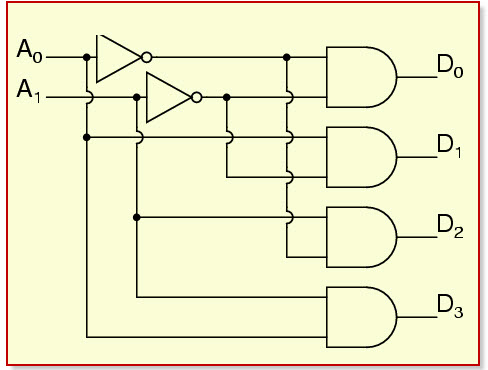
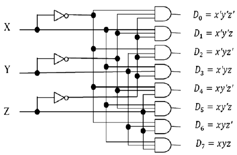
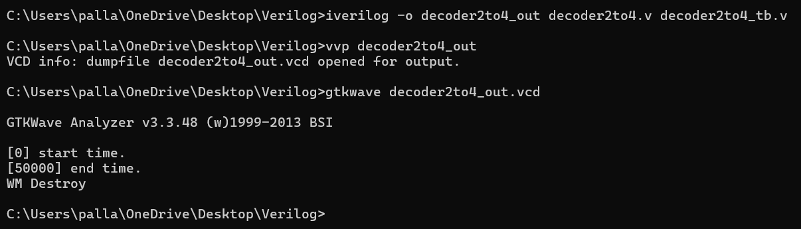

#  Decoders – 2:4 and 3:8

This repository contains Verilog HDL implementations and testbenches for:
- 2-to-4 Decoder
- 3-to-8 Decoder

## Introduction

A **decoder** is a combinational logic circuit that converts binary information from `n` input lines to a maximum of `2^n` unique output lines.  
Each output corresponds to one of the possible combinations of the input signals. Decoders are widely used in memory addressing, data routing, and control unit designs.

##  2:4 Decoder

###  Description

The 2:4 decoder takes 2-bit input and one enable signal. When enable is high, it activates one of the 4 outputs corresponding to the binary input. All other outputs remain low.

###  Truth Table

| `en` | `in[1:0]` | `out[3:0]` |
|------|-----------|------------|
|  0   |   XX      | 0000       |
|  1   |   00      | 0001       |
|  1   |   01      | 0010       |
|  1   |   10      | 0100       |
|  1   |   11      | 1000       |

###  Logic Diagram

##  3:8 Decoder

###  Description

The 3:8 decoder takes a 3-bit input and one enable signal. When enabled, it activates one of the 8 outputs based on the input combination, while all others remain low.

### Truth Table

| `en` | `in[2:0]` | `out[7:0]`     |
|------|-----------|----------------|
|  0   |   XXX     | 00000000       |
|  1   |   000     | 00000001       |
|  1   |   001     | 00000010       |
|  1   |   010     | 00000100       |
|  1   |   011     | 00001000       |
|  1   |   100     | 00010000       |
|  1   |   101     | 00100000       |
|  1   |   110     | 01000000       |
|  1   |   111     | 10000000       |

###  Logic Diagram

##  Terminal Commands

