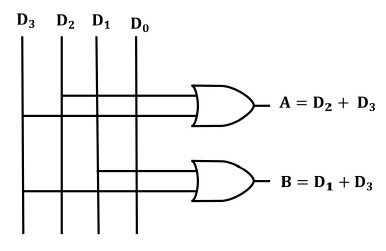
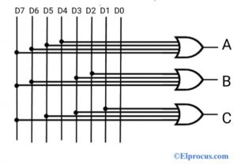
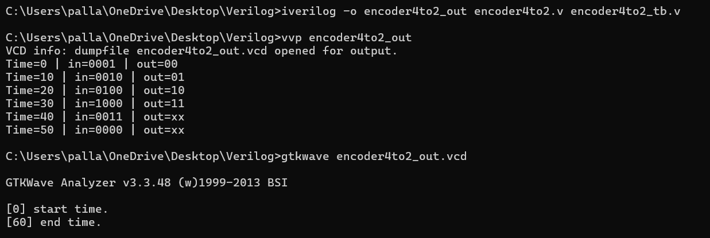

#  Encoders in Verilog

This repository contains Verilog implementations of:

- ✅ 4:2 Encoder  
- ✅ 8:3 Encoder  

Each design includes a **testbench**, waveform generation, and is simulation-ready using `iverilog` and `gtkwave`.

##  What is an Encoder?

An **encoder** is a combinational circuit that converts active input lines into a coded binary output. It reduces the number of data bits by encoding.

##  4:2 Encoder

###  Description:
A **4:2 encoder** takes **4 input lines** and encodes the index of the **active input** into a **2-bit output**.

###  Truth Table:

| `in[3:0]` | `out[1:0]` |
|-----------|------------|
| 0001      | 00         |
| 0010      | 01         |
| 0100      | 10         |
| 1000      | 11         |

> ⚠️ Assumes only one input is high at a time. Multiple active inputs result in undefined output.

###  Logic Diagram:

## 8:3 Encoder

###  Description:
An **8:3 encoder** takes **8 input lines** and encodes the index of the **active input** into a **3-bit output**.

###  Truth Table:

| `in[7:0]`       | `out[2:0]` |
|----------------|------------|
| 00000001        | 000        |
| 00000010        | 001        |
| 00000100        | 010        |
| 00001000        | 011        |
| 00010000        | 100        |
| 00100000        | 101        |
| 01000000        | 110        |
| 10000000        | 111        |

> ⚠️ Assumes only one input is high at a time. All zeros or multiple highs → undefined.

###  Logic Diagram:

##  Simulation Commands

