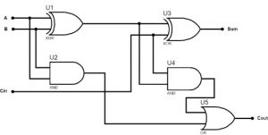
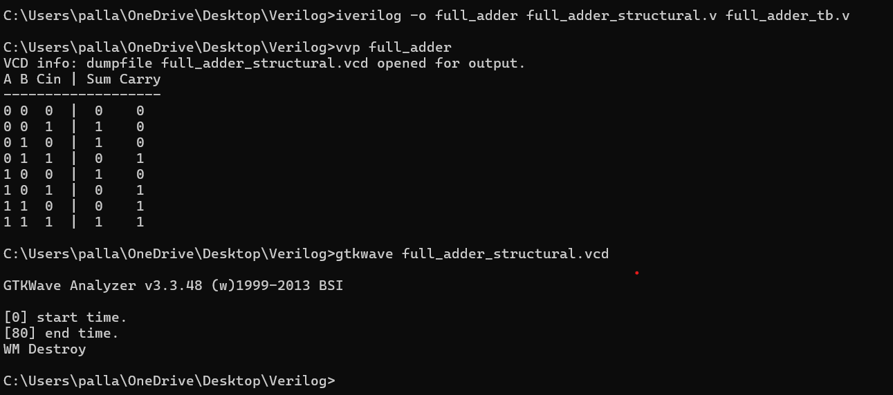

# Full Adder 

This project demonstrates the Verilog implementation of a **Full Adder** using **Dataflow**, **Behavioral**, and **Structural modeling** techniques.

## 📝 Project Overview

A **Full Adder** is a combinational circuit that performs the addition of three binary bits (**A**, **B**, and **Cin**) and produces two outputs:
- **Sum = A ⊕ B ⊕ Cin**
- **Carry = AB + BCin + ACin**

## 📁 Folder Structure

| File Name                      | Description |
|------------                    |-------------|
| `full_adder_dataflow.v`        | Dataflow modeling |
| `full_adder_behavioral.v`      | Behavioral modeling |
| `full_adder_structural.v`      | Structural modeling |
| `full_adder_tb.v`              | Testbench (for Structural) |
| `full_adder_structural.vcd`    |Simulation dump file |
| `Full Adder logic diagram.jpg` | Logic diagram of Full Adder |
| `Full_adder_waveform.png`      | Waveform screenshot |
| `full_adder commands.png`      | Screenshot of terminal commands|
| `README.md`                    | Project documentation |

---

## 🖼️ Logic Diagram

✅ Truth Table

| A | B | Cin | Sum (A ⊕ B ⊕ Cin) | Carry (AB + BCin + ACin) |
|---|---|-----|---------------------|---------------------------|
| 0 | 0 |  0  |          0          |             0             |
| 0 | 0 |  1  |          1          |             0             |
| 0 | 1 |  0  |          1          |             0             |
| 0 | 1 |  1  |          0          |             1             |
| 1 | 0 |  0  |          1          |             0             |
| 1 | 0 |  1  |          0          |             1             |
| 1 | 1 |  0  |          0          |             1             |
| 1 | 1 |  1  |          1          |             1             |

## 🚀 How to Simulate

