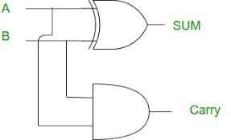

# Half Adder (Verilog)

This project demonstrates the implementation of a **Half Adder** in Verilog using **Dataflow**, **Behavioral**, and **Structural** modeling techniques.

## 📝 Project Overview
A Half Adder is a combinational circuit that performs the addition of two single-bit binary numbers. It provides two outputs:
- **Sum (A ⊕ B)**
- **Carry (A ⋅ B)**

## 📁 Folder Structure

| File Name                    | Description |
|------------                  |-------------|
| `half_adder_dataflow.v`      | Verilog code using **Dataflow modeling** |
| `half_adder_behavioral.v`    | Verilog code using **Behavioral modeling** |
| `half_adder_structural.v`    | Verilog code using **Structural modeling** |
| `half_adder_tb.v`            | **Testbench** (designed for Dataflow model) |
| `half_adder.vcd`             | Simulation dump file (Dataflow model) |
| `half_adder.png`             | Waveform screenshot |
| `README.md`                  | Project documentation (this file) |

---

## 🖼️ Logic Diagram

## ✅ Truth Table

| A | B | Sum (A ⊕ B) | Carry (A ⋅ B) |
|---|---|--------------|----------------|
| 0 | 0 |      0       |        0       |
| 0 | 1 |      1       |        0       |
| 1 | 0 |      1       |        0       |
| 1 | 1 |      0       |        1       |

## 🚀 How to Run (Dataflow Testbench Example)

### Compile
iverilog -o half_adder half_adder_dataflow.v half_adder_tb.v

### Simulate
vvp half_adder

### View Waveform
gtkwave half_adder.vcd

You can modify the half_adder_tb.v file to test other models (behavioral/structural).
