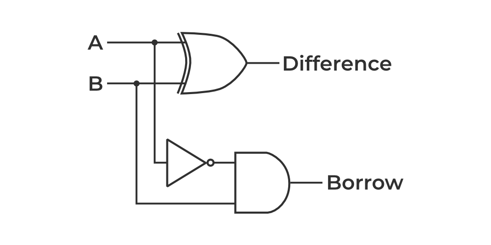
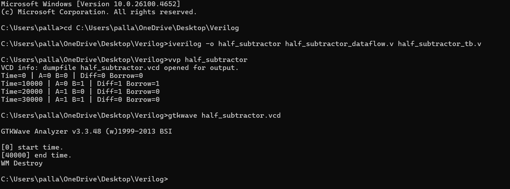

# Half Subtractor 

This project demonstrates the **Half Subtractor** circuit using **Verilog**, implemented using **Dataflow**, **Behavioral**, and **Structural modeling** techniques. Simulation outputs are verified using GTKWave.

## 📝 Project Overview

A **Half Subtractor** is a combinational circuit that subtracts two binary digits (**A** and **B**) and produces two outputs:
- **Difference = A ⊕ B**
- **Borrow = A' ⋅ B**

## 📁 Folder Structure

| File Name                                 | Description |
|------------                               |-------------|
| `half_subtractor_dataflow.v`              | Dataflow model of Half Subtractor |
| `half_subtractor_behavioral.v`            | Behavioral model of Half Subtractor |
| `half_subtractor_structural.v`            | Structural model |
| `half_subtractor_tb.v`                    | Testbench |
| `half_subtractor.vcd`                     | Simulation output waveform |
| `half_subtractor_logic_diagram.png`       | Logic diagram of Half Subtractor |
| `half_subtractor_waveform.png`            | Simulation waveform screenshot |
| `half_subtractor_command.png`             | Terminal Commands screenshot |
| `README.md`                               | Project documentation |

---

## 📊 Logic Diagram

## ✅ Truth Table

| A | B | Difference (A ⊕ B) | Borrow (A' ⋅ B) |
|---|---|---------------------|-----------------|
| 0 | 0 |          0          |        0        |
| 0 | 1 |          1          |        1        |
| 1 | 0 |          1          |        0        |
| 1 | 1 |          0          |        0        |

## 📸 Terminal Commands

