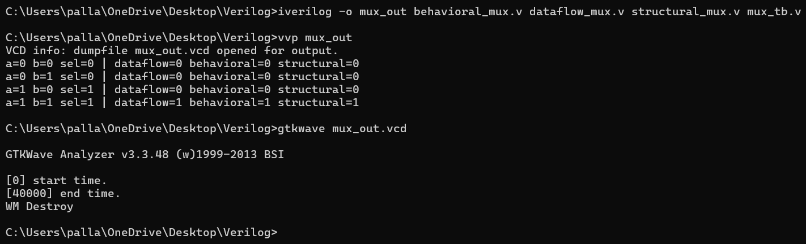

# 2:1 Multiplexer (MUX) 

This repository contains **Verilog implementations of a 2:1 Multiplexer (MUX)** using:

* **Dataflow Modeling**
* **Behavioral Modeling**
* **Structural Modeling**

A **common testbench** is provided to simulate all three models together with **GTKWave waveform visualization** support.

##  What is a MUX?

A **Multiplexer (MUX)** is a combinational circuit that selects one of the several input signals and forwards it to a single output line.

* **2:1 MUX** means two inputs, one select line, and one output.

##  Truth Table for 2:1 MUX

| **Select (sel)** | **Input a** | **Input b** | **Output (y)** | **Description**           |
|------------------|-------------|-------------|----------------|---------------------------|
| 0                | 0           | 0           | 0              | Select = 0 → Output = a   |
| 0                | 1           | 0           | 1              | Select = 0 → Output = a   |
| 1                | 0           | 1           | 1              | Select = 1 → Output = b   |
| 1                | 1           | 0           | 0              | Select = 1 → Output = b   |
The MUX can be mathematically written as:

y = (sel) ? b : a;

## ✅ How to Run

