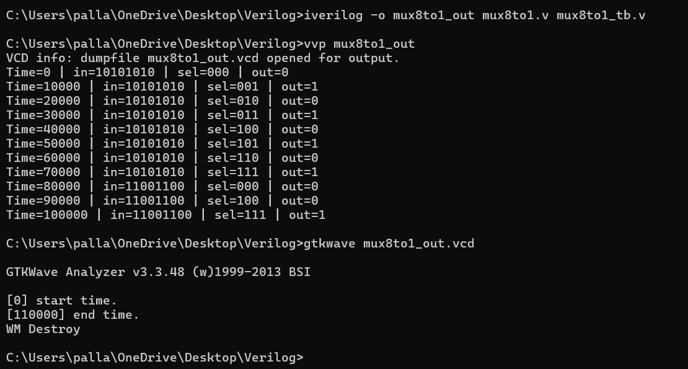

# 8:1 Multiplexer (MUX) 

This repository contains Verilog codes for designing an **8:1 Multiplexer** using:
-  **Dataflow Modeling**
-  **Hierarchical Modeling using 2:1 MUX Blocks**

  ## 📝 What is an 8:1 Multiplexer?

A **Multiplexer (MUX)** is a digital circuit that selects one of several input signals and forwards the selected input to a single output line.  
An **8:1 MUX** selects one input out of **8 inputs (I0 - I7)** using **3 select lines (S2, S1, S0)**.

It is commonly used in digital circuits for data routing, signal selection, and control systems.

## 📊 Truth Table for 8:1 MUX

| S2 | S1 | S0 | Output Y |
|----|----|----|----------|
| 0  | 0  | 0  | I0       |
| 0  | 0  | 1  | I1       |
| 0  | 1  | 0  | I2       |
| 0  | 1  | 1  | I3       |
| 1  | 0  | 0  | I4       |
| 1  | 0  | 1  | I5       |
| 1  | 1  | 0  | I6       |
| 1  | 1  | 1  | I7       |

## 🚀 How to Run the Code

