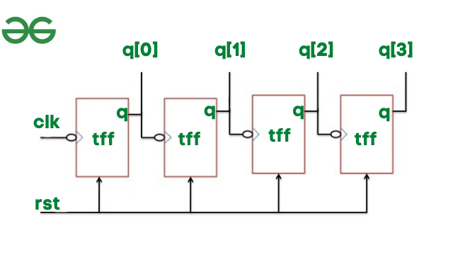

# 4-Bit Asynchronous (Ripple) Counters Using T Flip-Flops

This repository contains **4-bit asynchronous (ripple) up and down counters** implemented using T flip-flops.  
Ripple counters are **asynchronous** because each flip-flop toggles based on the output of the previous flip-flop rather than the main clock.

## 1. Asynchronous Ripple Up Counter

### **Description**
- The **first flip-flop (FF0)** toggles on the main clock (`clk`).  
- Subsequent flip-flops toggle on the **falling edge of the previous Q** to ensure proper counting.  
- Counts **upwards** from 0 to 15 (`0000 → 1111`).  

### **Behavior**

Binary Count Sequence (q3 q2 q1 q0):
0000 → 0001 → 0010 → 0011 → 0100 → ... → 1111 → 0000

## 2. Asynchronous Ripple Down Counter

### **Description**
- Counts downwards from 15 to 0 (1111 → 0000).
- Each flip-flop toggles on the rising edge of the previous Q (opposite edge convention to the up counter) to reverse counting.

### **Behavior**

 Binary Count Sequence (q3 q2 q1 q0):
 1111 → 1110 → 1101 → 1100 → 1011 → ... → 0000 → 1111

 ## Circuit Diagram 

 

 ## How to Run:

 ( Icarus Verilog and GTKWave Implementation)
 
  1) Open Terminal
     - iverilog -o rc_counter_up_out rc_counter_up.v rc_counter_up_tb.v
     - vvp rc_counter_up_out

  2) For viewing waveform
     - gtkwave rc_counter_up_out.vcd 

 

  
