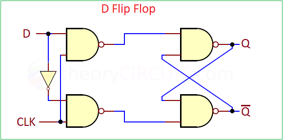

# D Flip-Flop (Data Flip-Flop)

This module contains a **positive-edge triggered D Flip-Flop** implemented in Verilog.  

##  Introduction
- The **D Flip-Flop** stores a single bit of data.  
- Inputs:  
  - **D (Data)** – Data to store  
  - **CLK (Clock)** – Flip-flop updates output on rising edge  
- Outputs:  
  - **Q** – Output  
  - **Q̅** – Complement output  

- Behavior:  
  - On **rising edge of CLK**, Q takes the value of D  
  - When CLK is low, Q holds its previous value  

##  Truth Table

| CLK↑ | D | Q(next) | Q̅(next) | Operation     |
|------|---|---------|----------|---------------|
| ↑    | 0 | 0       | 1        | Store 0       |
| ↑    | 1 | 1       | 0        | Store 1       |
| 0    | X | Q(prev) | Q̅(prev) | Hold          |

> CLK↑ indicates **rising edge of the clock**

##  Diagram

## How to Simulate

1)Compile and simulate:

iverilog -o d_ff_out d_ff.v d_ff_tb.v
vvp d_ff_out

2)View waveform:

gtkwave d_ff_out.vcd
