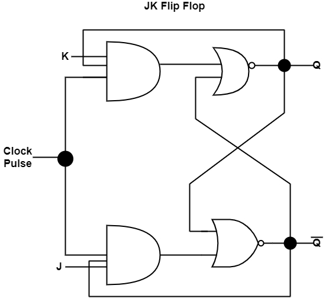

# JK Flip-Flop 

This folder contains the **Verilog implementation** and **testbench** for a **JK Flip-Flop**, one of the fundamental sequential circuits used in digital systems.  

##  Introduction
- The **JK Flip-Flop** is an improvement over the SR Flip-Flop.  
- It removes the invalid condition (S=R=1).  
- Inputs: **J, K, CLK**  
- Outputs: **Q, Q̅**  
- Key feature: When J=K=1, the output **toggles** on every clock pulse.  

##  Truth Table

| CLK↑ | J | K | Q(next) | Q̅(next) | Operation |
|------|---|---|---------|----------|-----------|
| ↑    | 0 | 0 | Q(prev) | Q̅(prev) | Hold      |
| ↑    | 0 | 1 | 0       | 1        | Reset     |
| ↑    | 1 | 0 | 1       | 0        | Set       |
| ↑    | 1 | 1 | ~Q      | ~Q̅      | Toggle    |

> **Note:** CLK↑ means the rising edge of the clock.

##  Circuit Diagram

##  How to Simulate

1)Compile and run using Icarus Verilog:

iverilog -o jk_ff_out jk_ff.v jk_ff_tb.v
vvp jk_ff_out

2)View waveform:

gtkwave jk_ff_out.vcd

