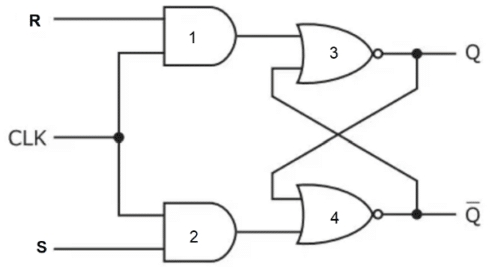

## SR Flip-Flop (Set-Reset Flip-Flop)

This repository contains the Verilog implementation and testbench for a **positive-edge triggered SR Flip-Flop**, a fundamental sequential circuit used in digital systems.  

##  Introduction
- The **SR Flip-Flop** is a clocked version of the SR Latch.  
- Inputs:  
  - **S (Set)** – Sets Q=1 on clock edge  
  - **R (Reset)** – Resets Q=0 on clock edge  
  - **CLK (Clock)** – Flip-flop responds on the **rising edge**  
- Outputs:  
  - **Q** – Output  
  - **Q̅** – Complement of Q  

## Truth Table

| CLK↑ | S | R | Q(next) | Q̅(next) | Operation        |
|------|---|---|---------|----------|-----------------|
| ↑    | 0 | 0 | Q(prev) | Q̅(prev) | Hold            |
| ↑    | 0 | 1 | 0       | 1        | Reset           |
| ↑    | 1 | 0 | 1       | 0        | Set             |
| ↑    | 1 | 1 | X       | X        | Invalid         |

> CLK↑ indicates **rising edge of the clock**

##  Diagram

## How to Run

1)Compile and run using Icarus Verilog:

iverilog -o sr_ff_out sr_ff.v sr_ff_tb.v
vvp tb_sr_flipflop

2)View waveform :

gtkwave sr_ff_out.vcd
