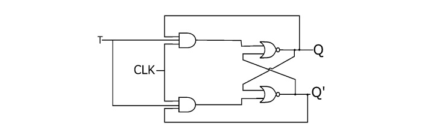

# T Flip-Flop 

This folder contains the **Verilog implementation** and **testbench** for a **T Flip-Flop** (Toggle Flip-Flop), a fundamental sequential circuit widely used in counters and frequency dividers.  

##  Introduction
- The **T Flip-Flop** is derived from the JK Flip-Flop by tying J = K = T.  
- It has one input **T (Toggle)** and a clock input **CLK**.  
- On each rising clock edge:
  - If T=0 → output holds its state.  
  - If T=1 → output toggles.  
- Outputs: **Q, Q̅**  

##  Truth Table

| CLK↑ | T | Q(next) | Q̅(next) | Operation |
|------|---|---------|----------|-----------|
| ↑    | 0 | Q(prev) | Q̅(prev) | Hold      |
| ↑    | 1 | ~Q      | ~Q̅      | Toggle    |

> **Note:** CLK↑ means rising edge of the clock.

##  Circuit Diagram

##  How to Simulate

1) Compile and run using Icarus Verilog:

iverilog -o t_ff_out t_ff.v t_ff_tb.v
vvp t_ff_out

2) View waveform:

gtkwave t_ff_out.vcd
