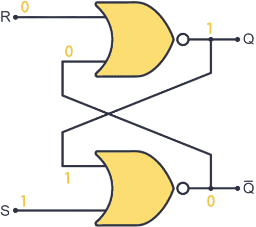
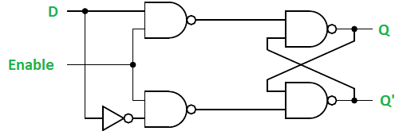
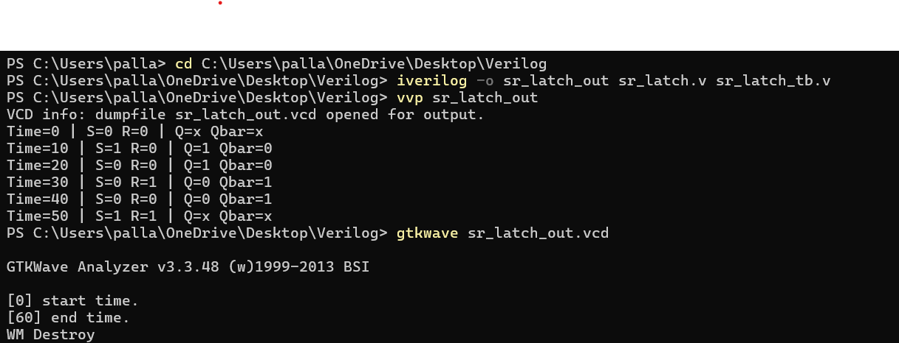

This repository contains Verilog implementations and testbenches for common **latches** used in digital sequential circuits.  

Included latches:  
- **SR Latch (Set-Reset Latch)**  
- **D Latch (Data Latch)**  

## 1. SR Latch (Set-Reset Latch)

### 🔹 Introduction
- The **SR Latch** is the simplest sequential circuit that stores **1 bit of data**.  
- Inputs: **S (Set)** and **R (Reset)**  
- Outputs: **Q** and **Q̅**  

###  Truth Table

| S | R | Q(next) | Q̅(next) | Operation        |
|---|---|---------|----------|-----------------|
| 0 | 0 | Q(prev) | Q̅(prev) | Hold            |
| 0 | 1 | 0       | 1        | Reset           |
| 1 | 0 | 1       | 0        | Set             |
| 1 | 1 | X       | X        | Invalid         |

### SR Latch Diagram

## 2. D Latch (Data Latch)

###  Introduction
- The **D Latch** eliminates the invalid state of SR Latch.  
- Inputs: **D (Data)** and **EN (Enable)**  
- Outputs: **Q** and **Q̅**  
- Behavior:
  - EN=1 → Q follows D (transparent mode)  
  - EN=0 → Q holds previous value (latch mode)  

###  Truth Table

| EN | D | Q(next) | Q̅(next) | Operation         |
|----|---|---------|----------|------------------|
| 0  | X | Q(prev) | Q̅(prev) | Hold             |
| 1  | 0 | 0       | 1        | Reset / Store 0  |
| 1  | 1 | 1       | 0        | Set / Store 1    |

### D Latch Diagram

## How to run
The Command prompt for SR Latch is shown:

