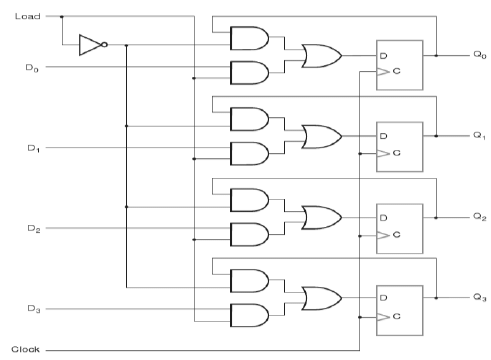

# 4-bit Parallel Register

This repository demonstrates a 4-bit parallel load register implemented in Verilog, along with a functional verification approach using randomized inputs and waveform analysis.
A parallel register is a fundamental digital building block, widely used in microprocessors, memory units, and digital circuits to store and manipulate data efficiently.

## Features

- 4-bit storage: Can store any 4-bit binary value simultaneously.
- Parallel load: Updates all 4 bits at once, allowing faster data storage compared to serial loading.
- Synchronous reset: Clears all bits to 0 on a clock edge when reset is high.
- Hold functionality: Retains previous value when neither reset nor load is active.
- Functional verification: Randomized testing ensures robustness under various conditions.

## How it Works: 

 **1) Clock-driven operation**

- The register updates only on the rising edge of the clock.
- Between clock edges, the stored value remains unchanged.

**2) Reset Behavior** 

- When reset=1 at a clock edge, the output q is set to 0000.
- Reset overrides load, ensuring the register is cleared regardless of the load signal.

**3) Load Behavior** 

- When reset=0 and load=1, the input data d[3:0] is loaded into the register.

**4) Hold Behavior** 

- When both reset=0 and load=0, the register retains its previous value.

## Truth Table

| Reset | Load | D[3:0] | Q[3:0] next |
| ----- | ---- | ------ | ----------- |
| 0     | 0    | xxxx   | Hold        |
| 0     | 1    | 1010   | 1010        |
| 1     | 0    | xxxx   | 0000        |
| 1     | 1    | 1100   | 0000        |

## Circuit Diagram

## How to Simulate

1) Compile and simulate using Icarus Verilog.

2) Generate waveform files (.vcd) for visualization in GTKWave.

3) Observe register behavior across clock edges with randomized d, load, and reset signals.

